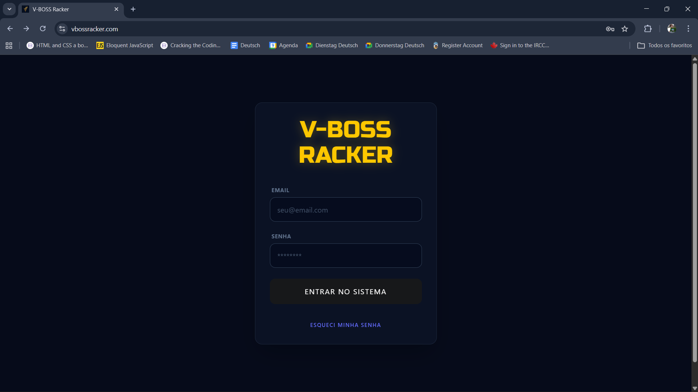
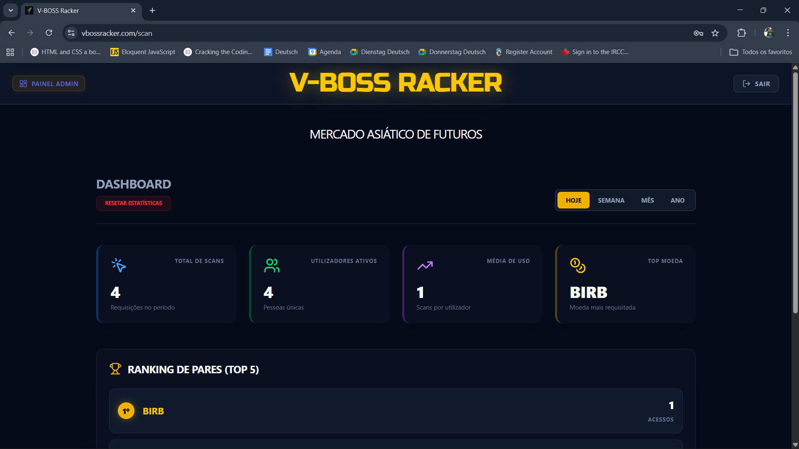
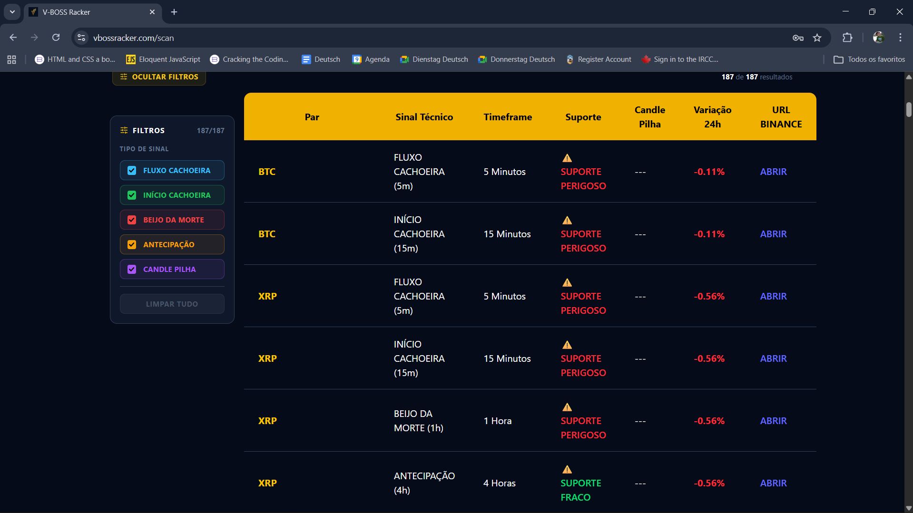

# V-BOSS Racker Ultra

Frontend de uma plataforma de análise de possibilidades de moedas no mercado com lógica própria.

## 🖥️ Demo
https://www.vbossracker.com/

## 🚀 Tecnologias
- React
- Tailwind CSS3
- JavaScript

## 📸 Screenshots

## 📌 Funcionalidades
- Login e autenticação
- Tabela de análise de moedas
- Interface responsiva